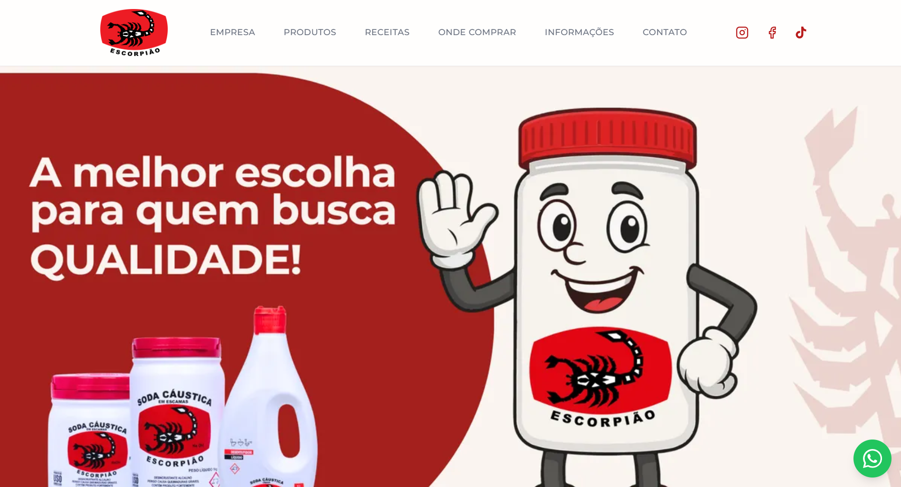
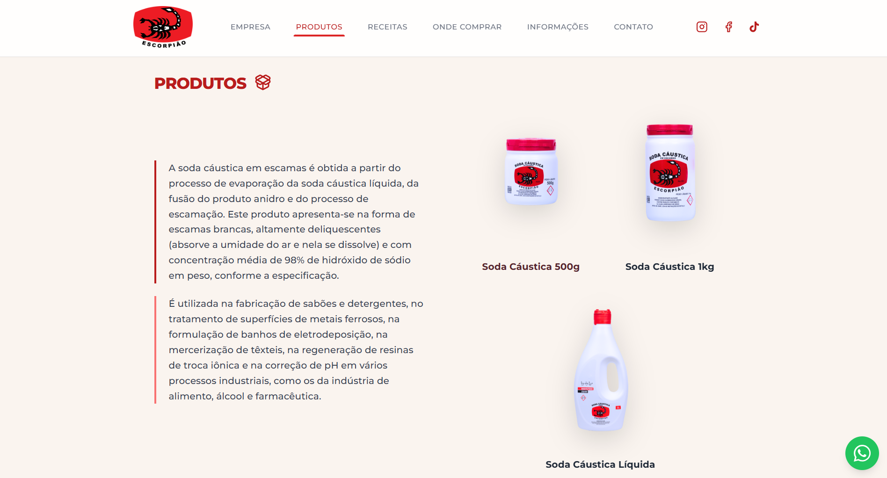
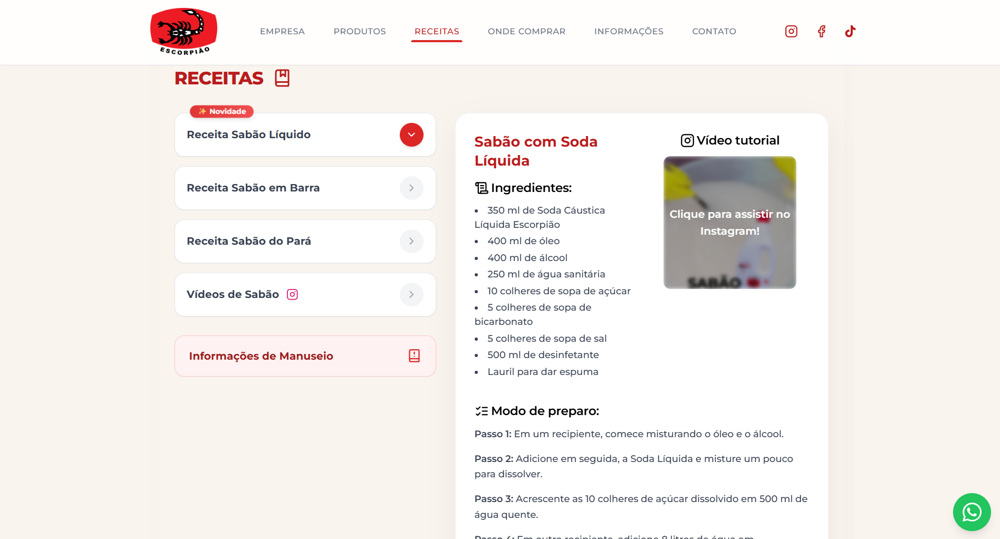
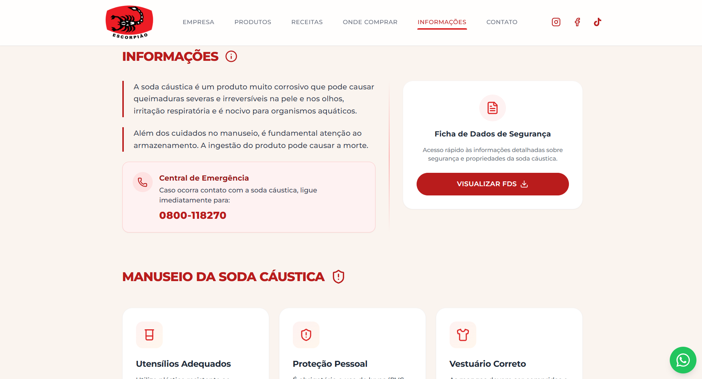
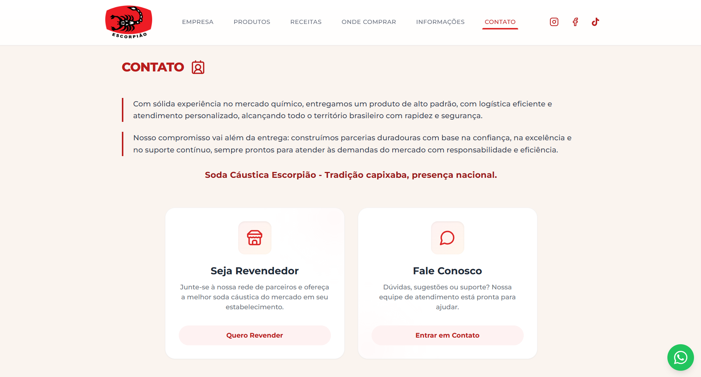
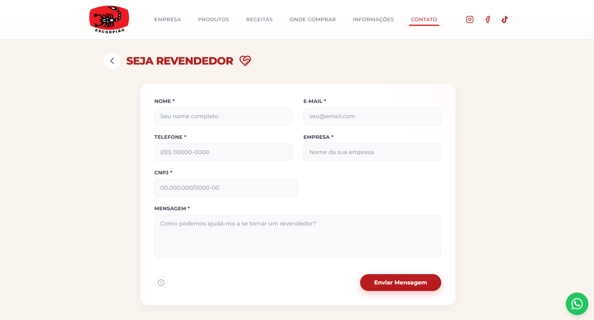
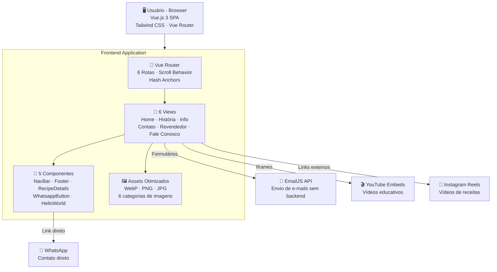

<p align="center">
  <h1 align="center">🦂 Soda Cáustica Escorpião — Site Institucional</h1>
  <p align="center">
    Site institucional moderno e responsivo desenvolvido do zero para uma indústria química com mais de 50 anos de tradição.
    <br/>
    <strong>Vue.js 3 · Vite 6 · Tailwind CSS 3 · EmailJS · Lucide Icons</strong>
  </p>
</p>

<p align="center">
  
  
  
  
  
  
</p>

---

## 📋 Sobre o Projeto

Site institucional desenvolvido para a **Soda Cáustica Escorpião**, indústria química fundada em **1970** na cidade de Vitória – ES, referência nacional no segmento de soda cáustica. O projeto apresenta a empresa, seus produtos, receitas de sabão caseiro, pontos de venda e canais de contato, tudo com uma interface moderna, animações fluidas e experiência responsiva.

Trata-se de uma **Single Page Application (SPA)** 100% frontend, sem necessidade de backend, banco de dados ou servidor dedicado — ideal para deploy estático em qualquer plataforma.

**🌐 Projeto em produção:** [sodaescorpiao.com.br](https://sodaescorpiao.com.br)

### 📸 Preview

<table>
  <tr>
    <td align="center"><br/><sub>Home / Landing Page</sub></td>
    <td align="center"><br/><sub>Seção Produtos</sub></td>
    <td align="center"><br/><sub>Seção Receitas</sub></td>
  </tr>
  <tr>
    <td align="center"><br/><sub>Informações & Manuseio</sub></td>
    <td align="center"><br/><sub>Hub de Contato</sub></td>
    <td align="center"><br/><sub>Formulário de Contato</sub></td>
  </tr>
</table>

---

## ✨ Funcionalidades

### 🏠 Home / Landing Page
- **Hero com imagem de capa** em tela cheia (otimizada em WebP)
- **Seção Empresa** com galeria de imagens em grid responsivo e texto institucional
- **Missão, Visão e Valores** com cards glassmorphism, ícones flutuantes e gradientes
- **Seção Produtos** com catálogo visual (Soda 500g, 1kg e Líquida) com efeitos de hover e drop-shadow dinâmico
- **Seção Receitas** interativa com sistema de abas (desktop) e accordion (mobile) para receitas de sabão caseiro
- **Vídeos do Instagram** com thumbnails clicáveis e integração direta com reels
- **Seção Onde Comprar** com grid de categorias de distribuidores
- Botão de ação **"Sobre Nós"** e **"Informações de Manuseio"**

### 📖 Nossa História (`/nossa-historia`)
- Página dedicada à história da empresa desde a década de 70
- Layout editorial com tipografia cuidada e animações de entrada

### ℹ️ Informações (`/info`)
- **Ficha de Dados de Segurança (FDS)** com download de PDF
- **Guia de manuseio** com cards informativos (EPIs, armazenamento, vestuário, combate a fogo)
- **Central de emergência** com telefone de contato
- **Vídeos educativos** do YouTube (EPIs e desentupimento)

### 📞 Contato (`/contato`)
- Hub central com dois caminhos: **Seja Revendedor** e **Fale Conosco**
- Cards interativos com hover effects e navegação por router-link

### 🤝 Seja Revendedor (`/contato/revendedor`)
- Formulário completo com: Nome, E-mail, Telefone, Empresa, CNPJ e Mensagem
- **Envio via EmailJS** (sem backend necessário!)
- Feedback visual: loading spinner, mensagem de sucesso/erro
- Validação de campos obrigatórios com tooltip informativo

### 💬 Fale Conosco (`/contato/fale-conosco`)
- Formulário de contato geral com: Nome, E-mail, Telefone, Empresa (opcional) e Mensagem
- **Envio via EmailJS** com feedback visual completo
- Mesmo padrão de UX do formulário de revendedor

### 🎨 Design & UX
- **Scroll animations** com Intersection Observer (reveal, scale, slide)
- **Navbar fixa** com backdrop blur, scroll spy por seção e indicador animado
- **Menu mobile** floating card com animação slide-fade
- **Botão flutuante WhatsApp** para contato direto
- **Footer** com informações de contato, redes sociais e créditos
- **Paleta de cores** consistente: tons de vermelho (#720e0e), bege (#faf4ef) e branco
- **Tipografia**: Google Fonts Montserrat (500–800)
- **Totalmente responsivo**: desktop, tablet e mobile

---

## 🛠️ Stack Tecnológica

| Tecnologia | Uso |
|---|---|
| **Vue.js 3** | Framework SPA com Composition API (`<script setup>`) |
| **Vite 6** | Build tool ultrarrápido e dev server com HMR |
| **Tailwind CSS 3.4** | Estilização utilitária responsiva |
| **Vue Router 4** | Roteamento SPA com scroll behavior customizado (hash anchors) |
| **EmailJS** | Envio de e-mails direto do frontend (sem backend) |
| **Lucide Vue Next** | Biblioteca de ícones SVG (40+ ícones utilizados) |
| **Sharp** | Otimização de imagens em build (conversão para WebP) |
| **Google Fonts** | Tipografia: Montserrat (500, 600, 700, 800) |

---

## 🏗️ Arquitetura



---

## 📂 Estrutura do Projeto

```
project_escorpiao/
│
└── frontend/
    ├── index.html                    # Entry point HTML com meta tags e Google Fonts
    ├── vite.config.js                # Configuração do Vite (plugin Vue)
    ├── tailwind.config.cjs           # Configuração do Tailwind (fonte Montserrat)
    ├── postcss.config.js             # PostCSS com Tailwind e Autoprefixer
    ├── package.json                  # Dependências e scripts
    ├── optimize-images.js            # Script de otimização de imagens (Sharp → WebP)
    │
    ├── public/
    │   ├── IconeEscorpiaoQuadrado.png   # Favicon
    │   └── static/uploads/              # PDFs (Ficha de Dados de Segurança)
    │
    └── src/
        ├── App.vue                   # Root component (NavBar + Router View + Footer + WhatsApp)
        ├── main.js                   # Bootstrap da app Vue + Router
        ├── style.css                 # Reset de estilos globais
        │
        ├── router/
        │   └── index.js              # 6 rotas com scroll behavior customizado
        │
        ├── views/
        │   ├── HomeView.vue          # Landing page completa (Empresa, Produtos, Receitas, Onde Comprar)
        │   ├── HomeHistory.vue       # Página "Nossa História"
        │   ├── InfoView.vue          # Informações de segurança + manuseio + vídeos
        │   ├── ContactView.vue       # Hub de contato (Revendedor / Fale Conosco)
        │   ├── ContactDealer.vue     # Formulário "Seja Revendedor" (EmailJS)
        │   └── ContactUs.vue         # Formulário "Fale Conosco" (EmailJS)
        │
        ├── components/
        │   ├── NavBar.vue            # Navbar fixa com scroll spy, menu mobile e redes sociais
        │   ├── Footer.vue            # Footer com contato, redes sociais e créditos
        │   ├── RecipeDetails.vue     # Componente de receitas (4 tipos: barra, Pará, vídeos, líquida)
        │   ├── WhatsappButton.vue    # Botão flutuante do WhatsApp
        │   └── HelloWorld.vue        # Componente padrão do Vite (não utilizado)
        │
        └── assets/
            ├── LogoEscorpiao.png     # Logo principal
            ├── empresa/              # Imagens da seção empresa (6 fotos + ícones missão/visão/valores)
            ├── identidade/           # Imagem de capa da home (WebP otimizado)
            ├── produto/              # Imagens dos produtos (500g, 1kg, líquida)
            ├── receitas/             # Thumbnails dos vídeos de receitas
            ├── ondeComprar/          # Ícones dos pontos de venda
            └── local/                # Imagens de localização
```

---

## 🖼️ Otimização de Imagens

O projeto inclui um script customizado de otimização de imagens utilizando **Sharp**:

```
Imagem Original (JPG/PNG)
  ↓
Sharp (Node.js)
  ├── Resize inteligente (800px para grid, 1200px para capa)
  ├── Conversão para WebP (quality 80)
  └── Output: arquivo-opt.webp
```

Resultando em **redução de 70–90% no tamanho dos arquivos** sem perda perceptível de qualidade.

---

## 🎬 Animações & Micro-interações

O site utiliza um sistema robusto de scroll animations baseado na **Intersection Observer API**:

| Tipo | Efeito | Uso |
|---|---|---|
| `reveal-element` | Fade in + slide up | Textos e títulos |
| `reveal-scale` | Fade in + scale up | Cards e imagens |
| `reveal-left` | Fade in + slide left | Botões de receitas |
| `icon-float` | Flutuação contínua | Ícones de Missão/Visão/Valores |
| `slide-fade` | Slide + fade (Vue transition) | Troca de conteúdo de receitas |
| `expand` | Accordion smooth | Receitas no mobile |

Cada animação utiliza **delays staggered** (100ms–600ms) para criar efeitos cascata suaves.

---

## 🚀 Como Rodar o Projeto

### Pré-requisitos

- **Node.js** versão 18 ou superior → [Download](https://nodejs.org/)
- **npm** (já vem com o Node.js)

### Passo a passo

```bash
# 1. Clone o repositório
git clone https://github.com/Xavis01/project_escorpiao.git

# 2. Entre na pasta do frontend
cd project_escorpiao/frontend

# 3. Instale as dependências
npm install

# 4. Inicie o servidor de desenvolvimento
npm run dev
```

O site estará disponível em `http://localhost:5173` 🎉

### Outros comandos úteis

```bash
# Gerar build de produção
npm run build

# Preview da build de produção
npm run preview

# Otimizar imagens (gera versões WebP)
node optimize-images.js
```

> **💡 Nota:** Por ser um site 100% frontend (SPA), não há necessidade de configurar backend, banco de dados ou variáveis de ambiente. Basta instalar as dependências e rodar!

---

## 📱 Responsividade

O site foi desenvolvido com abordagem **mobile-first**, garantindo perfeita visualização em:

- 📱 **Mobile** (< 768px) — Menu hamburger, accordion para receitas, layout empilhado
- 📊 **Tablet** (768px–1024px) — Grid adaptado, navegação híbrida
- 🖥️ **Desktop** (> 1024px) — Layout completo com scroll spy, receitas em painel lateral

---

## 🔗 Integrações

| Serviço | Uso |
|---|---|
| **EmailJS** | Envio de formulários de contato e revendedor (direto do frontend, sem backend) |
| **YouTube** | Vídeos educativos embeddados (EPIs, receitas) |
| **Instagram** | Links para reels de receitas de sabão |
| **WhatsApp** | Botão flutuante de contato direto |
| **Google Fonts** | Tipografia Montserrat |

---

## 👨‍💻 Autor

**Lucas Xavier**

---

<p align="center">
  <sub>Desenvolvido com dedicação — do design ao deploy. 🚀</sub>
</p>
